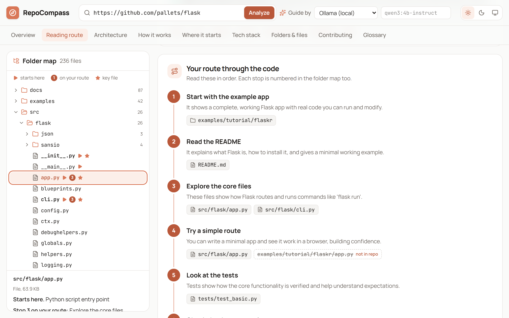
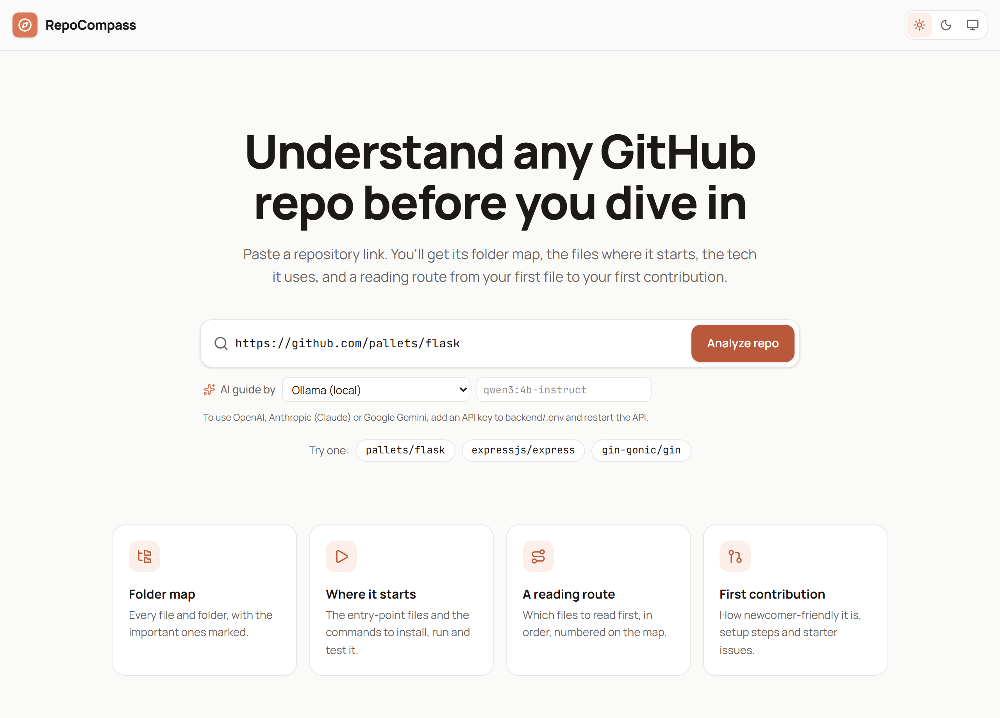
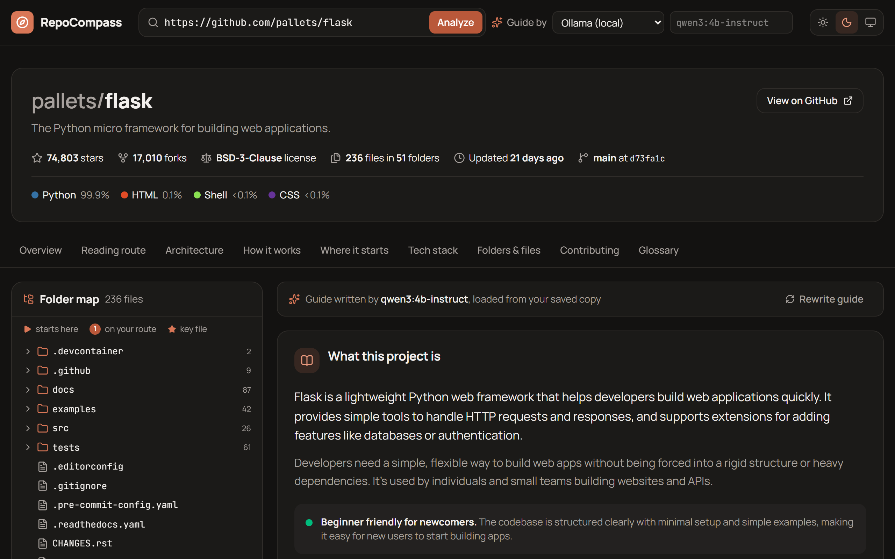
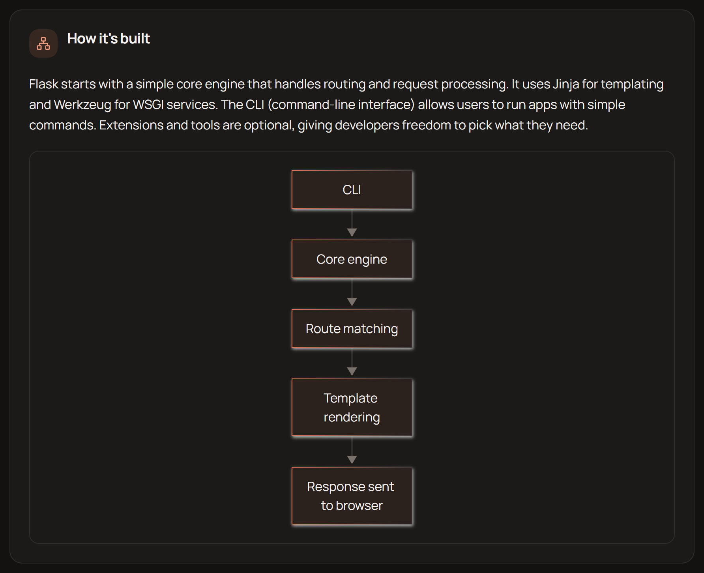
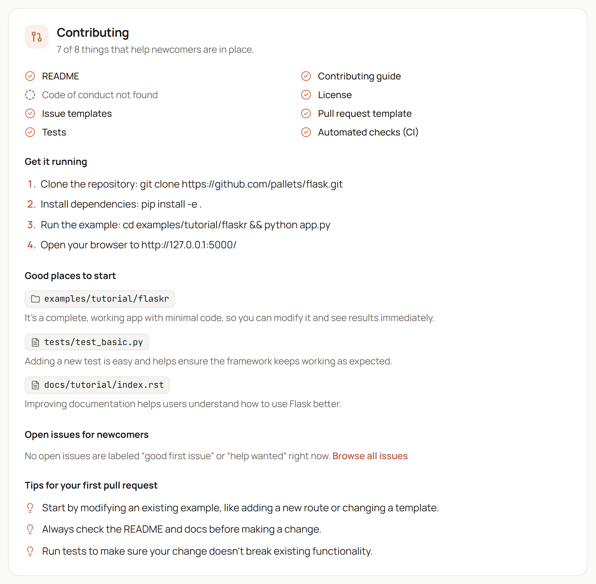
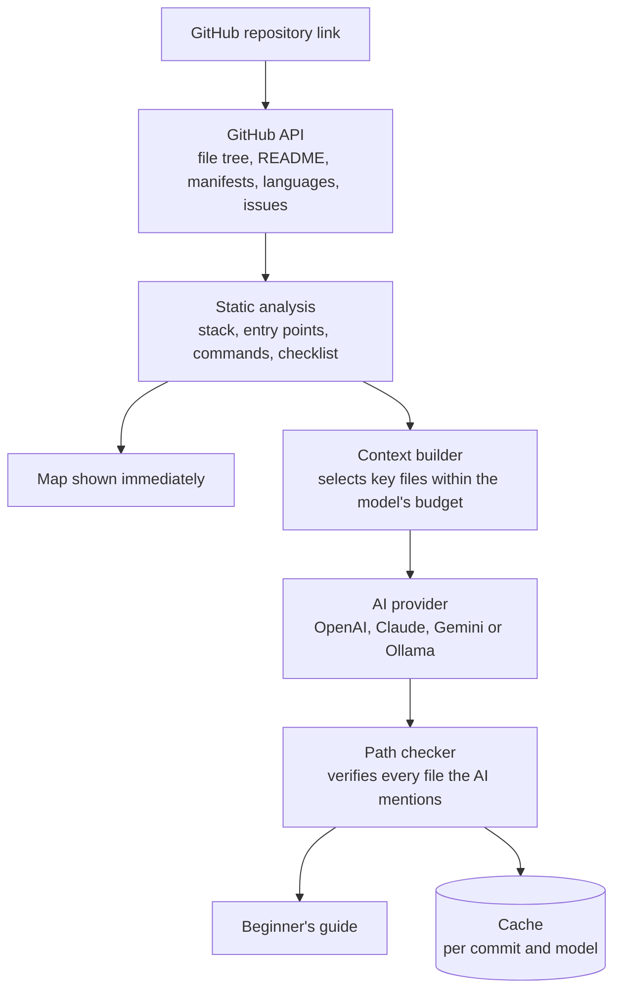
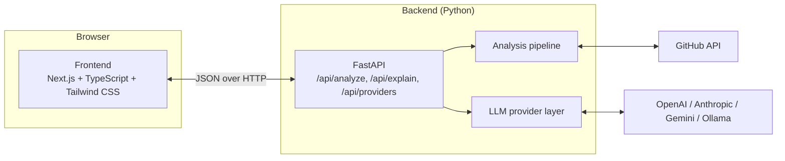

<div align="center">

# RepoCompass

**Understand any GitHub repository before you dive in.**

Paste a repository link and get a map of the codebase: where it starts, what it's built with,
how the pieces fit together, a reading route through the code, and a clear path to your first contribution.


[Screenshots](#screenshots) &nbsp;|&nbsp;
[Features](#features) &nbsp;|&nbsp;
[What makes it different](#what-makes-it-different) &nbsp;|&nbsp;
[How it works](#how-it-works) &nbsp;|&nbsp;
[Quick start](#quick-start) &nbsp;|&nbsp;
[Documentation](#documentation)

<br/><br/>



<sub>A reading route through <code>pallets/flask</code>. Stops are numbered in the folder map, and a path the AI invented is flagged <b>not in repo</b>.</sub>

</div>

---

## Why RepoCompass

Open-source projects are the best classroom a software engineer has, but they're hard to walk into.
A beginner with solid fundamentals opens a popular repository and finds hundreds of folders, unfamiliar
tooling and no obvious place to start. The same questions come up every time:

- *Where does this program actually start?*
- *What does each folder do, and which files matter?*
- *What technologies is it built with, and how do the parts talk to each other?*
- *What should I read first, and in what order?*
- *Is this project friendly to newcomers, and where could I contribute?*

Reading the README rarely answers these, and working them out by hand takes hours. Many people give up, and
lose confidence along the way.

**RepoCompass answers those questions in one place.** It turns an intimidating repository into a guided
tour, so you can go from *"I don't understand this codebase"* to *"I know how it's built and where to start."*

## Screenshots

**Start by pasting a repository link.** Pick an AI provider, or map the repository with no AI at all.



**Get the whole picture at a glance.** Repository vitals, languages, the interactive folder map and a
plain-English overview, shown here in the dark theme.



<table>
  <tr>
    <td width="50%" valign="top">
      <b>See how it's built.</b> An architecture summary and a diagram of the main components.
      <br/><br/>
      
    </td>
    <td width="50%" valign="top">
      <b>Find your way in.</b> A newcomer-readiness checklist, setup steps, starter areas and first-PR tips.
      <br/><br/>
      
    </td>
  </tr>
</table>

## Features

### Map the repository (instant, no AI needed)

- **Interactive folder map.** Browse every file and folder. Entry points, key files and reading-route stops
  are marked, and selecting any item shows what it does, with a link to it on GitHub.
- **Where it starts.** Detects entry points across ecosystems: `main.py`, `__main__.py`, `manage.py`,
  `main.go`, `src/main.rs`, `index.ts`, Next.js layouts, Spring Boot applications, `Program.cs`, Flutter,
  Rails routes and more, plus CLI commands declared in `package.json` and `pyproject.toml`.
- **Commands to run it.** Install, run and test commands read straight from `package.json` scripts (npm,
  Yarn, pnpm, Bun), Python tooling (pip, Poetry, uv, Pipenv), Cargo, Go, Makefile targets and Docker Compose,
  each with a copy button.
- **Tech stack detection.** Frameworks, libraries, databases and ORMs, test runners, build tools and DevOps
  tooling, grouped by category, each showing the file it was found in, plus the full dependency list.
- **Repository vitals.** Stars, forks, license, size, languages and last activity at a glance.

### Understand it (AI-written guide)

- **Overview.** What the project is, what problem it solves, and how hard it is for a newcomer.
- **Architecture.** A summary of the design, a generated **diagram**, the main components with their
  locations, and how data moves between them.
- **How it works.** The main workflow, step by step, naming the files involved.
- **Folders and key files.** What each important folder and file is responsible for.
- **Reading route.** An ordered learning path through the code, numbered on the folder map.
- **Glossary.** Beginner-friendly definitions of the terms and tools the project uses.

### Start contributing

- **Newcomer-readiness checklist.** README, contributing guide, code of conduct, license, issue and
  pull-request templates, tests and CI, each linked if present.
- **Setup steps and starter areas.** How to get it running locally, and parts of the codebase that are good
  first places to contribute.
- **Good first issues.** Open issues labeled *good first issue* or *help wanted*, pulled live from GitHub.

### Built for you, not for the provider

- **Choose your AI.** OpenAI, Anthropic (Claude), Google Gemini, or **local models through Ollama**, switchable
  per analysis from a menu, with any model name you like. OpenAI-compatible services work too.
- **Works without AI.** The map, stack, entry points, commands and checklist need no model and no API key.
- **Saved guides.** Guides are cached per commit and model, so reopening a repository is instant and free.
- **Compare models.** Rewrite a guide with a different model to see how they differ.
- **Clean, themeable interface.** Light, dark and system themes, a responsive layout, and keyboard-friendly controls.

## What makes it different

**Facts come from code; explanations come from AI.**
Anything that can be read directly from the repository (dependencies, entry points, commands, the file tree,
the contributor checklist) is determined by deterministic analysis, never guessed by a model. The AI is only
asked to *explain*, and it's given those verified facts to work from.

**Every path the AI mentions is verified.**
Language models sometimes invent files. RepoCompass checks every path in the written guide against the
repository's real file tree. Paths that exist become clickable links into the folder map; invented ones are
crossed out and labeled **not in repo**, so a hallucination can't send a beginner down the wrong path.

**Beginner-first by design.**
The output isn't a summary of the README. It's a technical map written for someone new to the codebase:
plain language, jargon explained, a difficulty rating, and a concrete order in which to read the code.

**Private and affordable when you want it.**
Run entirely on your own machine with Ollama, so no code or prompts leave your computer and nothing costs
money. Or use a cloud model when you want more depth. The choice is per analysis, not a setup decision.

**Efficient with large repositories.**
Instead of pushing an entire codebase into a model, RepoCompass builds a curated context (the README,
manifests, entry-point code and architecture docs) within each model's size budget. Big repositories stay
fast, cheap and within context limits.

## How it works



1. **Fetch.** The backend reads the repository through the GitHub API: metadata, the complete file tree,
   languages and open newcomer issues. File contents come from GitHub's raw file service, which doesn't count
   against API rate limits.
2. **Analyze.** Plain Python, with no AI, parses manifests (`package.json`, `pyproject.toml`,
   `requirements.txt`, `go.mod`, `Cargo.toml`, `pom.xml`, `composer.json`, `Gemfile` and more) and config
   files to detect the stack, then applies ecosystem-specific rules to find entry points and run commands.
   The map appears as soon as this step finishes.
3. **Build context.** The most informative material (verified facts, a compact outline of the folder
   structure, the README, top-level manifests, entry-point code and architecture docs) is packed in priority
   order into a budget sized for the chosen model.
4. **Explain.** The selected AI provider returns a structured guide as JSON. RepoCompass tolerates the usual
   quirks of smaller models (code fences, stray text, trailing commas) and retries once if the output is unusable.
5. **Verify and save.** Every path in the guide is checked against the real file tree, then the guide is
   cached against the exact commit and model.

### Architecture

RepoCompass is two applications that talk over a small JSON API:



| Layer | Technology | Responsibility |
|---|---|---|
| Frontend | Next.js 16, React 19, TypeScript, Tailwind CSS 4, Mermaid | The interface: search, folder map, guide, themes |
| API | FastAPI, Pydantic, HTTPX | Endpoints, validation, error messages, CORS |
| Analysis | Python standard library | Tree building, stack detection, entry points, run commands, context building |
| AI | OpenAI, Anthropic and Google GenAI SDKs; Ollama over HTTP | One `LLMProvider` interface, four interchangeable implementations |
| Quality | pytest, ESLint, TypeScript | Offline test suite with fake GitHub and AI; lint and type checks |

Adding a new AI provider means implementing a single `complete()` method; nothing else in the system changes.

## Quick start

You need **Python 3.11+** and **Node.js 20+**. Optionally install [Ollama](https://ollama.com) to run models locally (see the [Ollama guide](docs/ollama.md)).

```bash
# Terminal 1: backend (API on http://127.0.0.1:8000)
cd backend
python -m venv .venv
.venv\Scripts\activate            # Windows (macOS/Linux: source .venv/bin/activate)
pip install -r requirements.txt
cp .env.example .env              # add API keys or configure Ollama
python -m repocompass

# Terminal 2: frontend (open http://localhost:3000)
cd frontend
npm install
npm run dev
```

The complete setup, configuration reference, provider guide and troubleshooting are in
**[docs/how-to-run.md](docs/how-to-run.md)**.

## Repository layout

```
.
├── backend/     Python + FastAPI: GitHub access, analysis, AI providers, tests
├── frontend/    Next.js + TypeScript + Tailwind CSS: the web interface
└── docs/        setup guide, product requirements and the original project idea
```

## Documentation

| Document | What's inside |
|---|---|
| [How to run RepoCompass](docs/how-to-run.md) | Installation, configuration, AI providers, troubleshooting, project structure, API reference, development |
| [Running with Ollama (local AI)](docs/ollama.md) | Installing and starting Ollama, downloading models, connecting it, making it fast on your GPU, cloud models, troubleshooting |
| [Product requirements](docs/prd.md) | The original problem statement and goals |
| [Project idea](docs/project-idea.md) | The vision: from "I don't understand this repository" to "I know where to start" |

## Supported ecosystems

| Ecosystem | Detected from |
|---|---|
| JavaScript / TypeScript | `package.json`, lockfiles (npm, Yarn, pnpm, Bun), framework configs |
| Python | `requirements*.txt`, `pyproject.toml` (PEP 621 and Poetry), `setup.py`, `setup.cfg`, `Pipfile` |
| Go | `go.mod` |
| Rust | `Cargo.toml` |
| Java / Kotlin | `pom.xml`, `build.gradle`, `build.gradle.kts` |
| PHP | `composer.json` |
| Ruby | `Gemfile` |
| C# / .NET | `*.csproj` |
| Dart / Flutter | `pubspec.yaml` |
| Elixir | `mix.exs` |
| DevOps and tooling | Docker, Docker Compose, GitHub Actions, GitLab CI, CircleCI, Jenkins, Terraform, Helm, Kubernetes, Make, CMake, Bazel, and common linters, test runners and docs tools |

The file tree, languages, entry-point heuristics and the AI guide work for repositories in any language.

## Limitations

- **GitHub only.** Public repositories work out of the box; private ones need a `GITHUB_TOKEN` with access.
- **Rate limits.** Without a token, GitHub allows 60 API requests per hour (roughly ten analyses). A free
  token raises this to 5,000.
- **Very large repositories.** GitHub returns at most about 100,000 files per tree. Bigger repositories get a
  partial map, and the interface says so.
- **The AI reads a curated slice.** The guide is based on the most informative files, not every file, so
  deep internals are described at a high level.
- **Model quality varies.** Small local models are slower and write rougher guides than large cloud models.
  Path verification catches invented files, but other statements can still be imperfect.

## Roadmap

- Stream the guide section by section, so the first parts appear while the rest is being written
- "Explain this file" on demand, for any file in the folder map
- Match good first issues to the skills you already have
- Export a guide as Markdown for your notes
- Compare two similar repositories side by side

## Contributing

Contributions are welcome. See [Development](docs/how-to-run.md#development) for how to run the tests, linter
and type checks. The backend suite runs entirely offline, so it's fast and needs no API keys.
