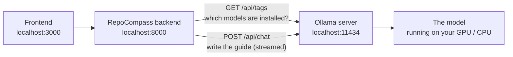

# Running RepoCompass with Ollama (local AI)

[Ollama](https://ollama.com) runs AI models on your own computer. RepoCompass can use it instead of a paid
AI service, so writing guides is **free, private, and works offline**, with **no API key**.

This guide walks you through the setup one step at a time, with a check after each step so you know it
worked. After that it covers daily use, speed on your hardware, model choices and fixing problems.
For the rest of RepoCompass's setup, see [How to run RepoCompass](how-to-run.md).

## Contents

- [Ollama or an API key?](#ollama-or-an-api-key)
- [Step-by-step setup](#step-by-step-setup)
  - [Step 1: Install Ollama](#step-1-install-ollama)
  - [Step 2: Make sure Ollama is running](#step-2-make-sure-ollama-is-running)
  - [Step 3: Download a model](#step-3-download-a-model)
  - [Step 4: Test the model](#step-4-test-the-model)
  - [Step 5: Tell RepoCompass to use Ollama](#step-5-tell-repocompass-to-use-ollama)
  - [Step 6: Start RepoCompass](#step-6-start-repocompass)
  - [Step 7: Pick Ollama in the app and write a guide](#step-7-pick-ollama-in-the-app-and-write-a-guide)
- [Every time you use it](#every-time-you-use-it)
- [Switching between Ollama and an API key](#switching-between-ollama-and-an-api-key)
- [How RepoCompass talks to Ollama](#how-repocompass-talks-to-ollama)
- [Speed and memory: making it fit your GPU](#speed-and-memory-making-it-fit-your-gpu)
- [Choosing a model](#choosing-a-model)
- [Ollama cloud models](#ollama-cloud-models)
- [Stopping Ollama](#stopping-ollama)
- [Command cheat sheet](#command-cheat-sheet)
- [Troubleshooting](#troubleshooting)

## Ollama or an API key?

RepoCompass needs an AI model to write its guides. It can get one in two ways:

| | Cloud provider (OpenAI, Anthropic, Gemini) | Ollama (local) |
|---|---|---|
| **What you set up** | Create an account on their website and copy an **API key** | **Install Ollama** and **download a model** |
| **What goes in `backend/.env`** | The secret key, e.g. `OPENAI_API_KEY=sk-...` | The model's name, e.g. `OLLAMA_MODEL=qwen3:4b-instruct`. **No key.** |
| **Where the AI runs** | On the provider's servers | On your computer |
| **Cost** | Pay per use | Free |
| **Privacy** | The repository summary is sent to the provider | Stays on your computer |
| **Internet for the AI step** | Always needed | Only once, to download the model |
| **Speed** | Fast | Depends on your graphics card (GPU) |

Here's the difference in `backend/.env`:

```ini
# ── Option A: a cloud provider ──────────────────────────────────
# You paste a secret key; the AI runs on the provider's servers.
OPENAI_API_KEY=sk-your-key-here

# ── Option B: Ollama ────────────────────────────────────────────
# No key. You tell RepoCompass which model you downloaded.
DEFAULT_LLM_PROVIDER=ollama
OLLAMA_MODEL=qwen3:4b-instruct
```

So instead of "get a key and paste it", the Ollama setup is: **install Ollama → download a model → name
that model in `backend/.env`.** You can set up both and switch between them in the app at any time.

## Step-by-step setup

Plan for about 15 minutes, most of it the one-time model download (about 2.5 GB). Each step ends with a
**Check**. Don't move on until it passes; the [Troubleshooting](#troubleshooting) table covers what to do
if one doesn't.

### Step 1: Install Ollama

**Windows**

1. Go to **[ollama.com/download](https://ollama.com/download)** and download the Windows installer.
2. Run it and click through the installer.
3. When it finishes, Ollama starts by itself and a small **llama icon** appears in the system tray
   (bottom-right of the taskbar, near the clock; click the `^` arrow if you don't see it).

**macOS:** download the app from [ollama.com/download](https://ollama.com/download), drag it into
Applications and open it.

**Linux:** run

```bash
curl -fsSL https://ollama.com/install.sh | sh
```

> ✅ **Check:** open a **new** terminal (one opened before installing won't know the command yet) and run
> `ollama --version`. It prints something like `ollama version is 0.34.4`.

### Step 2: Make sure Ollama is running

Ollama works in the background as a small **server** on your computer, at `http://localhost:11434`.
RepoCompass sends it requests, much like it sends requests to OpenAI's servers when you use an API key.
The server must be running whenever you want AI guides.

- **Windows:** it's already running. The installer adds Ollama to your startup apps, so it starts every
  time you log in. The tray icon means it's on.
  - If the icon isn't there, open **Ollama** from the Start menu.
  - Or run `ollama serve` in a terminal and keep that terminal open (closing it stops Ollama).
- **macOS:** open the Ollama app; the icon sits in the menu bar.
- **Linux:** the installer runs Ollama as a background service; `systemctl status ollama` shows it.

> ✅ **Check:** open **<http://localhost:11434>** in your web browser. The page says **Ollama is running**.

> If `ollama serve` fails with *"bind: Only one usage of each socket address..."*, Ollama is
> **already running**. That's fine; there's nothing to start.

### Step 3: Download a model

A **model** is the AI "brain" that Ollama runs. RepoCompass's default is **`qwen3:4b-instruct`**: small
enough for most laptops (about 2.5 GB), and good at following instructions and writing the structured
answer (JSON) RepoCompass asks for.

```bash
ollama pull qwen3:4b-instruct
```

You'll see a progress bar; it ends with `success`. This is a one-time download, and after it the model
works without internet.

> ✅ **Check:** run `ollama list`. You see `qwen3:4b-instruct` with a size of about 2.5 GB.

Models are stored in `%USERPROFILE%\.ollama\models` on Windows (`~/.ollama/models` on macOS and Linux).
Want a different model? See [Choosing a model](#choosing-a-model); just use its name wherever this guide
says `qwen3:4b-instruct`.

### Step 4: Test the model

Optional, but it proves Ollama works before RepoCompass gets involved:

```bash
ollama run qwen3:4b-instruct "Explain what a README file is in one sentence."
```

The first answer can take a little while, because Ollama loads the model into memory first.

> ✅ **Check:** the model prints a sensible sentence. The Ollama side is now done.

(Run `ollama run qwen3:4b-instruct` with no prompt to chat with it; type `/bye` to leave.)

### Step 5: Tell RepoCompass to use Ollama

**This is the step that replaces pasting an API key.** RepoCompass reads its settings from the file
`backend/.env`.

1. Open a terminal in the project folder and create the file (only the first time):

   ```powershell
   cd backend
   copy .env.example .env          # Windows
   ```

   ```bash
   cd backend
   cp .env.example .env            # macOS / Linux
   ```

2. Open it in a text editor, e.g. `notepad .env` on Windows, or open `backend/.env` in VS Code.

3. Find the Ollama lines and make sure they say:

   ```ini
   DEFAULT_LLM_PROVIDER=ollama
   OLLAMA_BASE_URL=http://localhost:11434
   OLLAMA_MODEL=qwen3:4b-instruct
   OLLAMA_NUM_CTX=8192
   ```

   These are already the defaults in `.env.example`, so usually there's nothing to change.

   | Setting | What it means | Change it when... |
   |---|---|---|
   | `DEFAULT_LLM_PROVIDER` | Which AI provider the app selects the first time you open it | You'd rather start with a cloud provider |
   | `OLLAMA_BASE_URL` | Where the Ollama server is (Step 2) | You run Ollama on another port or machine |
   | `OLLAMA_MODEL` | The model to use, exactly as `ollama list` shows it | You downloaded a different model |
   | `OLLAMA_NUM_CTX` | How much text the model reads at once (its context window) | Guides are too slow, or you have a big GPU; see [Speed and memory](#speed-and-memory-making-it-fit-your-gpu) |

   Leave the `..._API_KEY` lines empty; they're only for cloud providers.

4. Save the file.

> ✅ **Check:** the `OLLAMA_MODEL` value matches a name in `ollama list` exactly, including the part after
> the `:`.

### Step 6: Start RepoCompass

RepoCompass runs in two terminals. (If this is your very first run, first create the Python environment
and install packages as described in [How to run RepoCompass](how-to-run.md#quick-start).)

**Terminal 1: the backend**

```powershell
cd backend
.venv\Scripts\activate          # macOS / Linux: source .venv/bin/activate
python -m repocompass
```

> ✅ **Check:** it prints `RepoCompass API running at http://127.0.0.1:8000`.

The backend reads `backend/.env` when it starts, so **restart it** (`Ctrl+C`, then run it again)
whenever you change that file.

**Terminal 2: the frontend**

```bash
cd frontend
npm run dev
```

> ✅ **Check:** it shows `Local: http://localhost:3000` and then **Ready**.

### Step 7: Pick Ollama in the app and write a guide

1. Open **http://localhost:3000**.
2. Next to **AI guide by**, choose **Ollama (local)**.

   > ✅ **Check:** the menu says **Ollama (local)**, not "Ollama (local) (not set up)", and the model box
   > next to it shows `qwen3:4b-instruct`. If it says *not set up*, Ollama isn't running (go back to
   > Step 2) or it started after the page opened (refresh the page).

3. Paste a repository link, for example `pallets/flask`, and press **Analyze repo**.

   > ✅ **Check:** the folder map and facts appear within seconds. Then a banner shows *Writing the guide
   > with qwen3:4b-instruct* with a timer, and the full guide appears when the model finishes.

**How long does it take?** It depends on your graphics card: from about a minute on a strong GPU to about
10 minutes on a 4 GB laptop GPU. You can keep reading the map meanwhile. If it's very slow, see
[Speed and memory](#speed-and-memory-making-it-fit-your-gpu).

**Behind the scenes:**

- **First request:** Ollama loads the model into memory, which takes a few seconds to a minute.
- **While writing:** run `ollama ps` in a terminal to watch the model and see where it's running (GPU/CPU).
- **Afterwards:** the model stays loaded for **5 minutes** (Ollama's default), so the next guide starts
  faster. Then Ollama unloads it to free memory.
- **Saved guides:** a finished guide is saved per repository commit and model, so opening the same repo
  again is instant. **Rewrite guide** makes a fresh one.

🎉 **That's it: RepoCompass is writing guides with a model running on your own computer.**

## Every time you use it

Setup is done once. After that, using RepoCompass with Ollama is:

1. **Ollama is running.** On Windows this is automatic: look for the tray icon. Unsure? Open
   <http://localhost:11434>.
2. **Start the backend:** `cd backend` → `.venv\Scripts\activate` → `python -m repocompass`
3. **Start the frontend:** `cd frontend` → `npm run dev`
4. **Open http://localhost:3000.** The app remembers that you picked Ollama last time.

No downloads, no keys, no costs.

## Switching between Ollama and an API key

You don't have to choose just one. Everything you've set up appears in the **AI guide by** menu:

- **Ready providers** can be selected: Ollama when it's running, and each cloud provider whose key is in
  `backend/.env`.
- **"(not set up)"** means that provider has no key yet (cloud) or isn't running (Ollama).
- **The app remembers your last choice.** `DEFAULT_LLM_PROVIDER` only decides what's selected the very
  first time.

To add a cloud provider next to Ollama, put its key in `backend/.env` (e.g. `ANTHROPIC_API_KEY=...`),
restart the backend and refresh the page. A handy workflow is to write a guide with Ollama for free, then
switch provider and press **Rewrite guide** to compare.

## How RepoCompass talks to Ollama



- **Ollama is a separate program.** RepoCompass's backend talks to its server but never starts or stops it.
- **When the page loads**, the backend asks Ollama which models are installed (`/api/tags`). If Ollama
  answers, "Ollama (local)" shows as ready, and your installed models are suggested in the model box.
- **When a guide is written**, the backend sends the repository summary to Ollama's chat endpoint
  (`/api/chat`) and asks for JSON. The answer is **streamed** back piece by piece, so a slow model on a
  laptop can take minutes without timing out.
- **Privacy:** the AI step happens entirely on your machine. RepoCompass still downloads the repository's
  files from GitHub; that part always needs the internet.

## Speed and memory: making it fit your GPU

How fast a local model runs depends mostly on whether it **fits in your graphics card's memory (VRAM)**.

### Read `ollama ps`

While a guide is being written, run:

```bash
ollama ps
```

```
NAME                 ID              SIZE      PROCESSOR          CONTEXT    UNTIL
qwen3:4b-instruct    0edcdef34593    4.1 GB    42%/58% CPU/GPU    8192       4 minutes from now
```

| Column | Meaning |
|---|---|
| `SIZE` | Memory the model is using: its weights **plus** memory for the context window. |
| `PROCESSOR` | **`100% GPU`** is fast. A split like `42%/58% CPU/GPU` means part of the model didn't fit in VRAM and runs on the much slower CPU. |
| `CONTEXT` | The context window in use (from `OLLAMA_NUM_CTX`). |
| `UNTIL` | When Ollama will unload the model if it isn't used again. |

### The context window (`OLLAMA_NUM_CTX`)

The context window is how much text the model can read at once, measured in tokens (roughly 3 characters
of code each). RepoCompass fills it with the most useful parts of the repository: key facts, the folder
outline, the README, config files and entry-point code. It keeps about 4,000 tokens free for its
instructions and the model's answer.

| `OLLAMA_NUM_CTX` | Repository text RepoCompass sends | Memory | Good for |
|---|---|---|---|
| `4096` | about 6,000 characters | lowest | very small GPUs or CPU-only machines |
| `8192` *(default)* | about 12,600 characters | moderate | 4 GB GPUs |
| `16384` | about 37,000 characters | higher | 8 GB GPUs |
| `32768` | about 86,000 characters | high | 12 GB+ GPUs |

A bigger window means a better-informed guide, but it needs more memory, and if it no longer fits in VRAM
everything slows down.

**A real example.** On a laptop with a **4 GB RTX 3050**, `qwen3:4b-instruct` used **5.4 GB at 16,384**
tokens (58% on the CPU, very slow) and **4.1 GB at 8,192** (42% on the CPU). A full guide took about
**10 minutes**. That's workable but slow; the tips below help.

> **Two similar settings.** `OLLAMA_NUM_CTX` in `backend/.env` is RepoCompass's setting, sent with every
> request. It always wins for RepoCompass. Ollama also has its own `OLLAMA_CONTEXT_LENGTH` environment
> variable, the default for other apps and for `ollama run`. You don't need to set both.

### Making it faster

In order of impact:

1. **Close other GPU-heavy programs** (games, video editors, many browser tabs with video) to free VRAM.
2. **Lower `OLLAMA_NUM_CTX`** in `backend/.env` (e.g. to `6144` or `4096`), restart the backend, and check
   `ollama ps` again. Aim for `100% GPU`.
3. **Shrink the context memory** with two Ollama settings. They cut the context window's memory roughly in
   half with little quality loss:
   ```
   OLLAMA_FLASH_ATTENTION=1
   OLLAMA_KV_CACHE_TYPE=q8_0
   ```
   These are settings for **Ollama itself**, not RepoCompass. See
   [Changing Ollama's own settings](#changing-ollamas-own-settings).
4. **Use a smaller model** (see [Choosing a model](#choosing-a-model)).
5. **Use an Ollama cloud model or a cloud provider** (OpenAI, Anthropic, Gemini) when you need speed or depth.

### Changing Ollama's own settings

Ollama reads its settings from environment variables when it starts. Run `ollama serve --help` to see them all.

**Windows:**

1. **Quit Ollama:** right-click the tray icon and choose **Quit Ollama**.
2. Open **Settings**, search for **environment variables**, and choose **Edit environment variables for
   your account**.
3. Click **New...** and add each variable, e.g. name `OLLAMA_FLASH_ATTENTION`, value `1`.
4. Click **OK**, then start **Ollama** again from the Start menu.

Or from a terminal (applies to programs started afterwards):

```powershell
setx OLLAMA_FLASH_ATTENTION 1
setx OLLAMA_KV_CACHE_TYPE q8_0
```

**macOS / Linux:** set them in the environment `ollama serve` runs in, then restart Ollama. For the Linux
service, run `sudo systemctl edit ollama.service`, add the lines below, then
`sudo systemctl restart ollama`:

```ini
[Service]
Environment="OLLAMA_FLASH_ATTENTION=1"
Environment="OLLAMA_KV_CACHE_TYPE=q8_0"
```

Settings you might use:

| Variable | What it does |
|---|---|
| `OLLAMA_FLASH_ATTENTION=1` | Faster, leaner attention. Required for `OLLAMA_KV_CACHE_TYPE`. |
| `OLLAMA_KV_CACHE_TYPE=q8_0` | Stores the context window at 8-bit precision: about half the memory. |
| `OLLAMA_KEEP_ALIVE=30m` | Keep models loaded longer between guides (default `5m`). |
| `OLLAMA_MODELS=D:\ollama-models` | Store models somewhere else. |
| `OLLAMA_HOST=127.0.0.1:11500` | Run Ollama on another port. Then set `OLLAMA_BASE_URL=http://localhost:11500` in `backend/.env`. |
| `OLLAMA_NO_CLOUD=1` | Turn off Ollama's cloud features entirely. |

## Choosing a model

Any Ollama model that can follow instructions works. Type its name in the model box, or set `OLLAMA_MODEL`.
Rough guide by GPU memory (browse all models at **[ollama.com/library](https://ollama.com/library)**):

| Your GPU memory | Try | Size | Notes |
|---|---|---|---|
| No GPU / 2-4 GB | `llama3.2:3b` | ~2 GB | Fastest; shortest guides |
| 4 GB | **`qwen3:4b-instruct`** | ~2.5 GB | RepoCompass's default |
| 8 GB | `qwen3:8b`, `qwen2.5-coder:7b` | ~5 GB | Noticeably better guides |
| 16 GB+ | `gpt-oss:20b` | ~13 GB | Strong reasoning |

Model sizes are the download size; they need extra memory for the context window while running.

**Tips:**

- **Instruct / chat models work best.** RepoCompass asks for structured JSON, and small "base" models or
  models tuned only for code completion may return broken output.
- **If a model keeps failing** with *"didn't return valid JSON"*, try a bigger model or another family.
- **To compare models**, write a guide, pick a different model, and press **Rewrite guide**. Each model's
  guide is saved separately.

## Ollama cloud models

Models whose name ends in **`-cloud`**, like `gpt-oss:120b-cloud`, are listed and chosen like local
models, but they **run on Ollama's servers**. They're much bigger and faster than anything a laptop can
run locally.

```bash
ollama signin                   # connect this machine to your ollama.com account (once)
ollama pull gpt-oss:120b-cloud  # adds it to your list; almost nothing is downloaded
```

Then type `gpt-oss:120b-cloud` in RepoCompass's model box (or set `OLLAMA_MODEL`).

Keep in mind:

- **Not private.** The repository summary is sent to ollama.com, unlike local models.
- **Usage limits.** Free accounts have usage limits; see ollama.com for current plans.
- **Needs internet.**
- **Context budget.** RepoCompass decides how much of the repository to send using `OLLAMA_NUM_CTX`, which
  is shared by all Ollama models. If you mainly use cloud models, you can raise it to send more context.
  Local models will then use more memory too.

## Stopping Ollama

| To... | Do this |
|---|---|
| Free the memory a model is using | `ollama stop qwen3:4b-instruct` (it reloads on the next request) |
| Stop Ollama completely (Windows) | Right-click the tray icon → **Quit Ollama** |
| Stop a server you started with `ollama serve` | Press `Ctrl+C` in that terminal |
| Stop it starting at login (Windows) | Task Manager → **Startup apps** → Ollama → **Disable** |
| Delete a model you don't need | `ollama rm <model>` |

While Ollama is stopped, RepoCompass shows "Ollama (local) (not set up)". Everything except the AI guide
keeps working.

## Command cheat sheet

| Command | What it does |
|---|---|
| `ollama --version` | Show the installed version |
| `ollama serve` | Start the server in this terminal (Windows usually runs it for you) |
| `ollama pull <model>` | Download a model |
| `ollama list` | List downloaded models |
| `ollama run <model>` | Chat with a model in the terminal (`/bye` to exit) |
| `ollama ps` | Show loaded models, their memory use and GPU/CPU split |
| `ollama stop <model>` | Unload a model from memory |
| `ollama show <model>` | Show a model's details (size, context length, capabilities) |
| `ollama rm <model>` | Delete a model |
| `ollama signin` | Sign in to ollama.com (needed for `-cloud` models) |

## Troubleshooting

| Problem | Fix |
|---|---|
| **"Ollama (local) (not set up)"** in the provider menu | Ollama isn't running, or it started after the page loaded. Start it (see [Step 2](#step-2-make-sure-ollama-is-running)), then refresh the page. |
| *"Can't reach Ollama at http://localhost:11434. Is it running?"* | Same as above. If Ollama runs on another address or port, set `OLLAMA_BASE_URL` in `backend/.env` and restart the backend. |
| *"Ollama model '…' not found. Pull it with `ollama pull …`"* | The model name in the box isn't installed. Run `ollama pull <name>`, or pick one from `ollama list`. Names must match exactly, including the tag after `:`. |
| *"Ollama stopped responding for 5 minutes"* | The model is too large for your machine at this context size. Lower `OLLAMA_NUM_CTX`, try the memory settings above, or use a smaller model. |
| *"… didn't return valid JSON twice in a row"* | Small models sometimes produce broken output. Press **Try again**; if it keeps happening, use a bigger model. |
| The guide takes many minutes | Check `ollama ps`. A CPU/GPU split means the model doesn't fit in VRAM; see [Making it faster](#making-it-faster). The first request also includes loading the model. |
| `ollama` isn't recognized as a command | Open a new terminal after installing. On Windows, check that `%LOCALAPPDATA%\Programs\Ollama` is on your `PATH`, or reinstall. |
| `ollama serve` says *"Only one usage of each socket address"* | Ollama is already running. Nothing to do. |
| A cloud model fails | Run `ollama signin`, check your internet connection and your ollama.com usage limits. |
| Guides use lots of memory even when idle | Models stay loaded for 5 minutes after use. Run `ollama stop <model>` to unload right away, or set `OLLAMA_KEEP_ALIVE` lower. |
